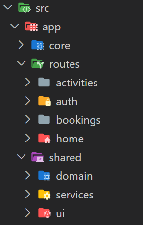

# NgLab

Angular Laboratory for courses and workshops by [Alberto Basalo](https://albertobasalo.dev)

> [!NOTE]
> Angular sample Activity Bookings is at [ActivityBookings](./ActivityBookings) folder

This project was generated with [Angular CLI](https://github.com/angular/angular-cli) version 17.1.1.

```bash
# clone lab from github
git clone https://github.com/AlbertoBasalo/ng-lab.git
# install and run
cd ng-lab/ActivityBookings
npm install
# start Angular server
npm start
# start a fake API server
npm run seedapi
```

## Documentation

Find detailed journal of instructions in [CLI.md](./docs/CLI.md)

### Folder structure

Have an outlook of the project folders structure



> [!TIP]
> Companion article:

- [English version](https://medium.com/@albertobasalo/file-and-folder-structure-for-angular-applications-3130efc582e3)

- [Versión en Español](https://www.linkedin.com/pulse/estructura-de-archivos-y-carpetas-para-aplicaciones-angular-basalo-3vcff)

## Testing

This project is being _e2e_ tested with **Cypress**. Find the testing code at this repository

- [**cy-lab**](https://github.com/AlbertoBasalo/cy-lab)

[](https://albertobasalo.dev)

---

<footer>
  <h3>🧑🏼‍💻 By <a href="https://albertobasalo.dev" target="blank">Alberto Basalo</a> </h3>
  <p>
    <a href="https://twitter.com/albertobasalo" target="blank">
      
    </a>
  </p>
  <p>
    <a href="https://github.com/albertobasalo" target="blank">
      
    </a>
  </p>
</footer>
